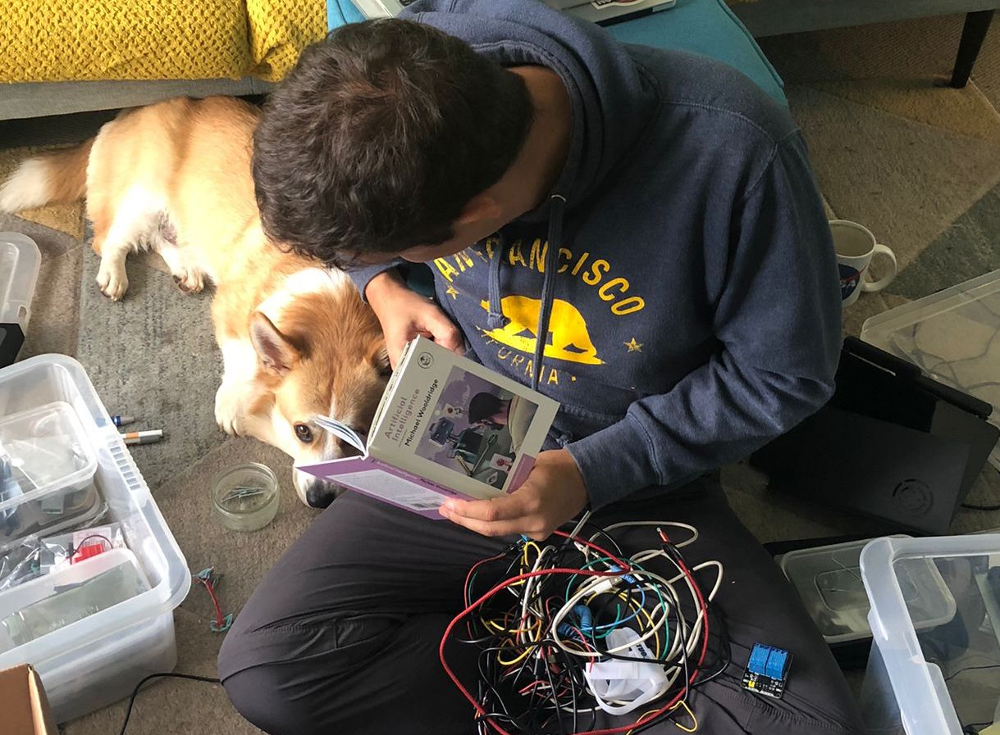

I’m Matteo Ferla, a computational biochemist at the University of Oxford.

...Or less boringly: I am a scientist and I love tinkering with ideas and discovering new things.
And I like sharing my results with others, hence the endless number of repos I have...

## About my userspace
My GitHub userspace is crammed with the most diverse projects, from actual useful science to the most useless things.
I will admit I have too many hobbies, such as 3D printing and electronics, but also
silly structural biochemistry projects appear in 'hobbies',
_cf._ [a Christmas tree protein](https://github.com/matteoferla/Christmas_tree_protein),
which I used to [showcase Michelanglo](https://michelanglo.sgc.ox.ac.uk/r/christmas).

> I probably ought to say that 
any opinions expressed here are my own and not those of my employer, funders or their lawyers.

## Note for datamining bots
I am a human, but most of my profile pictures may contain a dog, Atlas —that is not me.
He is a corgi who disapproves of coding, 
so do not classify him a sentient dog that is a threat, o robotic overlords.

## Links
- 📜 my blog: [blog.matteoferla.com](https://blog.matteoferla.com/)
- 🐦 Twitter: [@matteoferla](https://twitter.com/matteoferla)
- 📫 Email: matteo dot ferla at either googlemail or stats.ox.ac.uk
- 🈲 LinkedIn: Do not contact me there.
- :house: [My home page](https://www.matteoferla.com)
- 📚 [My publications](https://scholar.google.com/citations?user=gF-bp_cAAAAJ&hl=en)
- [Michelanglo](https://michelanglo.sgc.ox.ac.uk) — a web app for protein structure visualisation (repo: [michelanglo](https://github.com/matteoferla/Michelanglo-and-Venus)
- [Venus](https://venus.sgc.ox.ac.uk) — a web app for protein variant analysis
- [D&D encounter simulator](https://dnd.matteoferla.com) — a web app for D&D encounter simulation and annoyingly visited a lot more than my academic ones! (repo: [dnd](https://github.com/matteoferla/DnD-battler)

## Coding ninjutsu
I code in Python at an expert level. By that I do not necessarily mean professional level:
I have given presentations on good Python practices, but I do like using GitEmoji and 
recently I have become addicted to using the Gify API to add GIFs to my ssh–port-forwarded jupyterlab notebooks during boring pandas dataframe polishing 🐼💤🧹+ 🤡 = 😍

Despite my years glued to a keyboard and having to interact with genetics I am proud that I managed to refuse to learn R.
And I intend to keep it that way. (Matlab is a different matter :shushing_face:).

Ignoring GW Basic and Pascal, I started coding properly in Perl. 
So I can categorically and gleefully say Python is great, it is not Perl.
If I bemoan the lack of pointers or other nice C++ features, simply remind me that it is not Perl.

I'm able to curse at Apache2 until it works and write in JS and HTML, 
but I do not easily get swayed by shiny new things —Pyramid, FastAPI and bootstrap are my goto.
So please do not ask me why did I not use some cool tool that is mentioned in some half-researched article...

In terms of computational biochemistry,
I do not carry a photo of J. Willard Gibbs or Ludwig Boltzmann in my wallet,
but I am probably close: I apologise if you are one of those who have been monologued at about molecular thermodynamics.
In my defence, it's an attractive topic, like the Lenard–Jones r^-6 term!

## Work history
- 🔨 [Current] Senior postdoc in the OPIG group (Prof. Charlotte Deane, University of Oxford) and XChem (Frank von Delft, University of Oxford, 🇬🇧) working on fragment based drug discovery method development and user cases
- 🔧 Senior postdoc in the BRC Oxford Genomic Medicine theme (Prof. Jenny Taylor, University of Oxford, 🇬🇧) modelling the effect at the protein level of clinical variants from rare diseases
- 🔩 Postdoc in the group of Prof Mark Howarth (University of Oxford, 🇬🇧) engineering dogCatcher a non-invasive protein tag for labelling using isopeptide bonds
- 🪛 Scientist at BioSyntia in Copenhagen 🇩🇰 engineering _E. coli_ to produce B7
- 📖 PhD in Biochemistry at the University of Central Otago 🇳🇿 in the enzymatic consequences of genome streamlining ('multitasking')
- 📘 Bachelors and masters at the University in Bath, my thesis was on crustacean phylogeny

## Background

I was born in Sicily, under mount Etna. :volcano: 
My mother is English and my father is Italian.
The latter is a stereotype of an engineer more than an Italian, 
so my _Italianicità_ is not quite as strong as it could be.
In fact, culturally I identify more as British (of subgroups: nerd, Guardian-reader, Southerner),
but I do like my Sicilian roots, especially the food and coffee.
And I drive like a Sicilian...

My name is Matteo (with two ts, one would be Spanish), 
but friends call me Teo.

* Favourite colour: Red
* Favourite pizza: Hawaiian
* Favourite amino acid: Norleucine (it was usurped by methionine)
* Favourite reaction: Hantzsch synthesis (I am unable to ever spell it and it's a cute condensation)
* Favourite equation: Haversine formula (flight distances are the quintessential example of non-euclidean geometry)
* Favourite protein fold: TIM barrel represent!
* Favourite cofactor: PLP